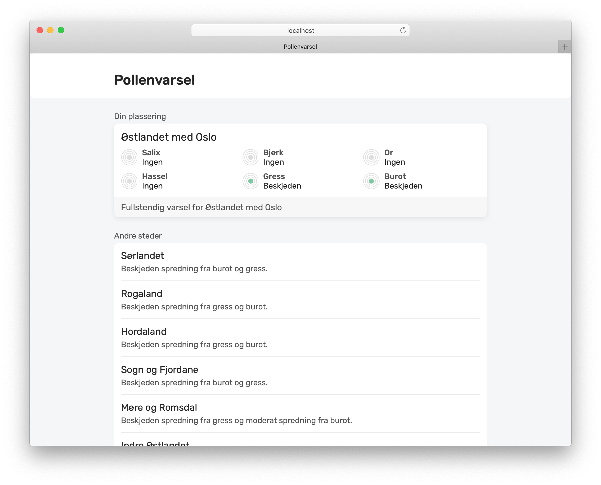

# pollenvarsel.app

## Deploy your own pollenvarsel

Since NAAF's pollen data is protected behind a paid API, there's no public website. You can deploy your own instance on [Netlify](https://netlify.com) after requesting an API key from NAAF (available for members).

